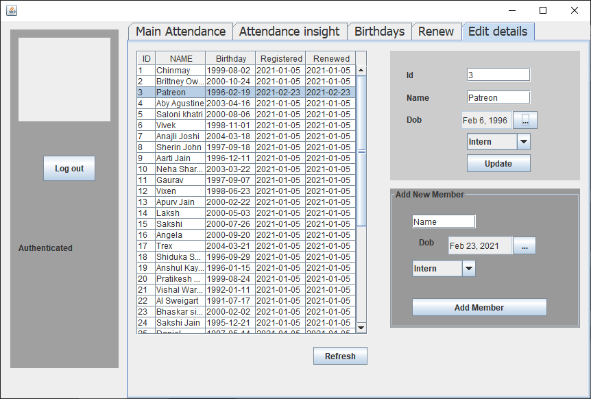
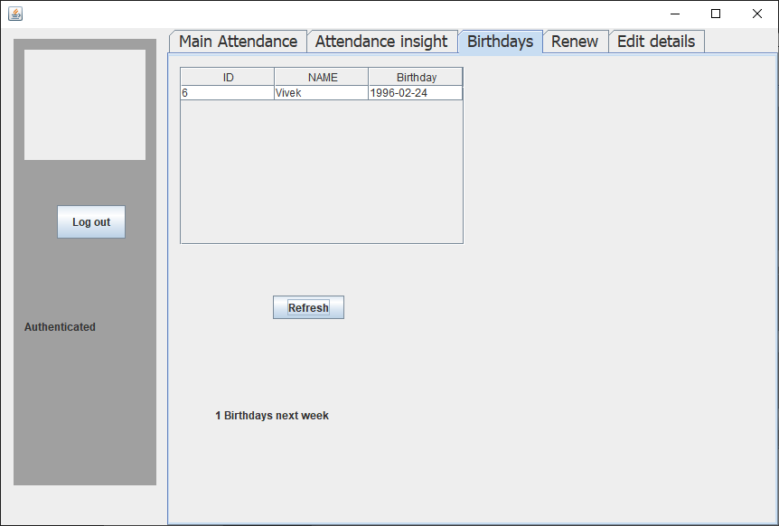
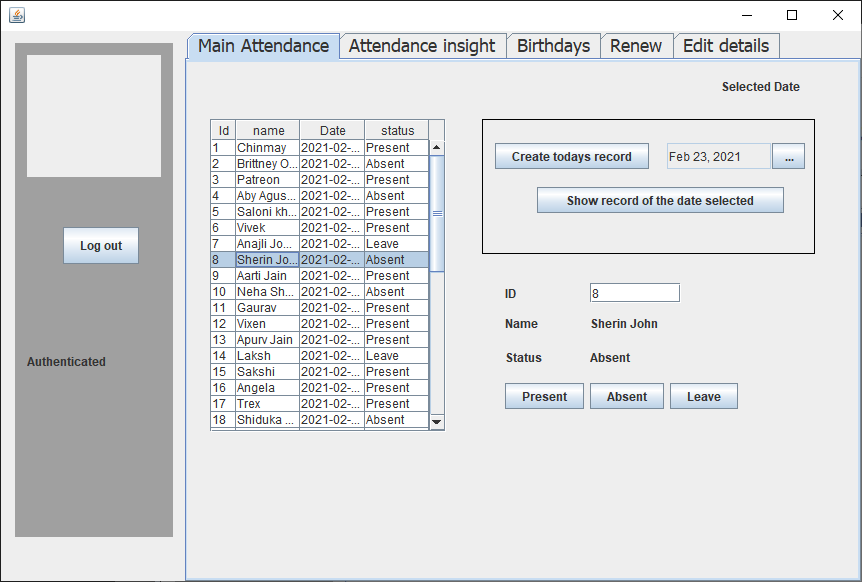
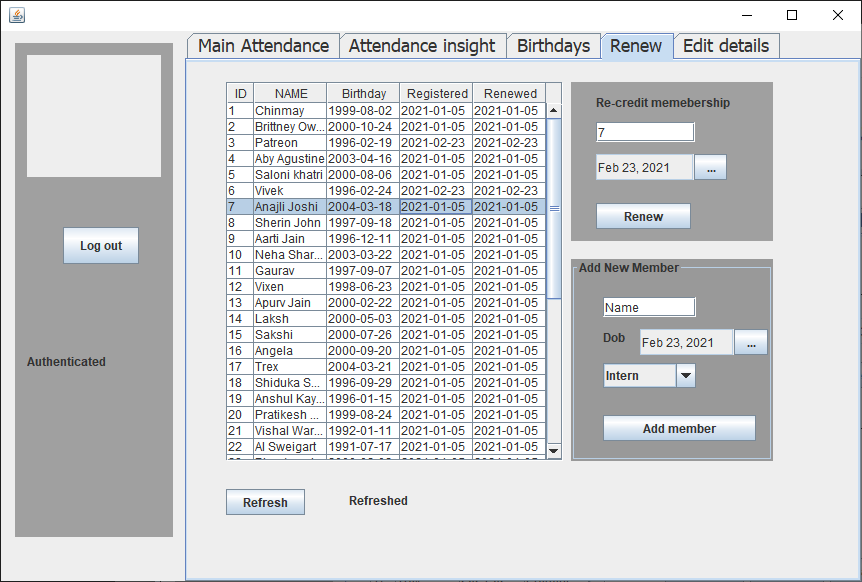
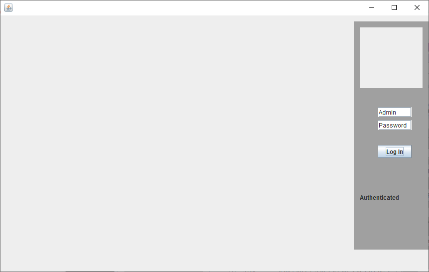
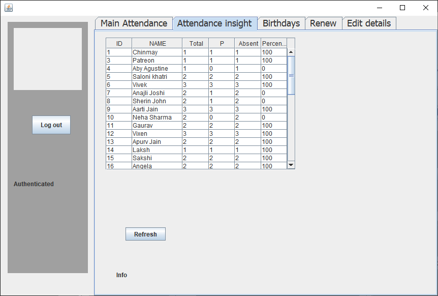

## AttendanceApp

>This Java app was created to save and edit the attendance of daily meet community.

>While running the app be sure to put all the files and dependecy in the build folder to a single folder. 

## Below are Screenshots of the App

## Edit User Details

## Birthday's this week

## Update Attendance

## Renew Subscription

## Login_page.png

## Insight_Attendance.png

